<div align="center">

# AI Animation Director

### Turn one animation idea into a production-ready AI video prompt package

Director treatment, story structure, character consistency, shot design, smart canvas planning,
video prompts, Jimeng adaptation, and production QA in one composable Codex Skill.

[](https://github.com/baichou6320-cpu/AI-Animation-Director/releases)
[](https://github.com/baichou6320-cpu/AI-Animation-Director/actions/workflows/validate.yml)
[](LICENSE)
[](ai-animation-director/SKILL.md)
[](ai-animation-director/prompts/platform_adapter.md)

[简体中文](README.zh-CN.md) · [Quick Start](#quick-start) · [Example](#example-output) · [Architecture](#architecture) · [Roadmap](#roadmap)

</div>

---

## What is AI Animation Director?

**AI Animation Director** is a Codex Skill for AI animation pre-production. It transforms a short idea, script, character concept, visual reference, or advertisement brief into an executable animation production package.

Instead of returning one overloaded prompt, it works like a small virtual animation team:

- a **producer** clarifies scope, duration, audience, platform, and deliverables;
- a **director** defines emotion, visual grammar, camera rules, performance, and rhythm;
- a **writer** turns the concept into a closed dramatic structure;
- a **design lead** locks character and scene consistency anchors;
- a **storyboard artist** breaks the story into feasible shots;
- a **prompt engineer** writes separate image and video prompts;
- a **QA reviewer** detects drift, overloaded motion, continuity risks, and model limitations.

The internal process can be detailed. The user-facing result stays compact, copyable, and ready to test.

> [!IMPORTANT]
> Version `v0.1.x` is primarily a **prompt and production-planning Skill**. It does not generate media by itself. The Jimeng-compatible API runner is experimental and requires provider-specific credentials and endpoint details.

## Why this project?

AI video projects often fail even when individual prompts look good.

| Common failure | How the Skill responds |
| --- | --- |
| Characters change between shots | Builds reusable character, costume, prop, and scene anchors |
| A shot contains too many actions | Limits each shot to one primary subject action and one camera action |
| "Cinematic" or "premium" is too vague | Translates adjectives into framing, palette, lighting, material, and pacing rules |
| Image and video prompts do not connect | Pairs every `VID-Sxx` block with a corresponding `IMG-Sxx` keyframe |
| The output is too long to use | Routes short projects into Quick Mode or Prompts Only |
| A model cannot execute the intended motion | Adds difficulty labels and a simpler fallback for each risky shot |
| Style references are too derivative | Converts references into generic visual traits instead of copying protected styles |

## What you get

Depending on the request, the Skill can produce:

- project brief and creative constraints;
- director treatment and visual grammar;
- short-film story structure, action lines, narration, and dialogue;
- character and environment consistency anchors;
- shot list with duration, framing, camera movement, action, transition, and difficulty;
- keyframe and reference-image prompts;
- Jimeng Smart Canvas asset, layout, blend, inpaint, expand, and keyframe export plans;
- image-to-video or text-to-video prompts;
- Jimeng-oriented copy blocks;
- lightweight music, ambience, and sound-effect direction;
- production risks, fallback shots, and final QA checks.

### Five output modes

| Mode | Best for | Visible output |
| --- | --- | --- |
| **Prompts Only** | "Just give me Jimeng prompts" | Global anchors, canvas asset prompts, video prompts, critical fixes |
| **Continue Mode** | Production has started; report success or failure | Current state, one next action, prompt, and checks |
| **Quick Mode** | 5-30 seconds, usually 3-6 shots | Anchors, asset preparation, per-shot execution cards |
| **Standard Mode** | 30-90 second shorts | Brief, concise treatment, story, bible anchors, full shot prompts |
| **Full Mode** | Complete package or team handoff | Full pre-production package with handoff notes and QA |

For Jimeng shorts under 30 seconds and 6 shots, **Quick Mode is the default**.
Once production starts, reply with messages such as "`IMG-S01` exported, continue" or "`VID-S02` failed" to receive only the next action.

## Quick start

### 1. Clone the repository

```bash
git clone https://github.com/baichou6320-cpu/AI-Animation-Director.git
cd AI-Animation-Director
```

### 2. Install the Skill

Copy only the `ai-animation-director` directory into your Codex skills directory.

**Windows PowerShell**

```powershell
Copy-Item -Recurse -Force `
  .\ai-animation-director `
  "$env:USERPROFILE\.codex\skills\ai-animation-director"
```

**macOS / Linux**

```bash
mkdir -p ~/.codex/skills
cp -R ./ai-animation-director ~/.codex/skills/ai-animation-director
```

Restart or open a new Codex session after installation.

### 3. Ask for an animation package

```text
Use $ai-animation-director to create a 10-second pixel-art animation
for Jimeng with exactly 3 shots. Keep the character consistent and
give me copy-ready image and video prompts.
```

Chinese requests work directly:

```text
使用 $ai-animation-director，帮我做一个 10 秒、3 个镜头的像素风动画，
用于即梦。只输出能直接复制使用的生图和图生视频提示词。
```

### 4. Execute in order

```text
IMG-REF  -> generate or import character/environment references
CV-OP-01 -> arrange, blend, or repair the shot on canvas
IMG-S01  -> export shot 1 keyframe from Z-S01
VID-S01  -> animate IMG-S01
IMG-S02  -> export shot 2 keyframe from Z-S02
VID-S02  -> animate IMG-S02
...
```

The stable IDs make it obvious which image belongs to which video prompt. Report a completed ID to enter Continue Mode.

## Example output

Input:

```text
10-second pixel-art animation, 3 shots, for Jimeng:
a small mushroom helps a firefly recover its light after the rain.
```

The Skill compresses the production plan into a package like this:

```markdown
# 10-second Pixel-Art Jimeng Package

## Project anchors and shot plan
- Character: round mushroom, red cap with exactly 3 cream spots...
- Scene: post-rain forest, moss, broad leaves, blue-violet night...
- Style: retro pixel art, low-resolution game frame, crisp pixel edges...
- Avoid: realistic insects, 3D toy look, text, watermark, character drift.

| Shot | Time | Image | Motion |
| --- | --- | --- | --- |
| S01 | 3s | Mushroom notices the dim firefly | Looks up; tail light flickers |
| S02 | 3s | Mushroom offers a dew drop | Firefly moves closer |
| S03 | 4s | Warm light fills the forest | Light brightens; mushroom blinks |

## Per-shot execution cards
### S01: Z-S01 -> IMG-S01 -> VID-S01
#### Canvas keyframe
Operation: CV-OP-01
Input assets: ASSET-CHAR-A, ASSET-SCENE-A
Type: blend
Export: IMG-S01

#### Video generation
Task: VID-S01
Use image: IMG-S01
Copy prompt: ...
Fallback: lock the camera and animate only the tail light.
```

After S01, reply:

```text
VID-S01 complete, continue
```

See the complete, final-format examples:

- [10-second pixel-art Jimeng package](ai-animation-director/examples/pixel-10s-3shots-jimeng.md)
- [30-second Chinese ink Jimeng package](ai-animation-director/examples/ink-30s-3shots-jimeng.md)
- [Jimeng prompts-only package](ai-animation-director/examples/prompts-only-jimeng.md)
- [Continue after a keyframe export](ai-animation-director/examples/continue-after-img-s01.md)
- [Retry one failed video step](ai-animation-director/examples/continue-after-video-failure.md)

## Production workflow

The Skill follows a real animation pre-production path, while using a shared `Project Packet` to pass decisions between specialist modules.

```mermaid
flowchart LR
    A["Idea / Script / Brief"] --> B["Intake"]
    B --> C["Project Brief"]
    C --> D["Director Treatment"]
    D --> E["Story"]
    E --> F["Character & Scene Bible"]
    F --> G["Shot List"]
    G --> H["Image & Platform Asset Prompts"]
    H --> I["Jimeng Smart Canvas"]
    I --> J["Keyframe Exports"]
    J --> K["Video Prompts"]
    K --> L["QA Review"]
    L --> M["Output Router"]
    M --> N["Copy-ready Package"]
```



Each stage receives upstream constraints and hands explicit requirements to the next stage. A director's camera rules reach the shot list; character anchors reach every image prompt; shot motion limits reach every video prompt.

## Architecture

```text
AI-Animation-Director/
├── ai-animation-director/
│   ├── SKILL.md                 # Skill entrypoint and orchestration
│   ├── agents/openai.yaml       # Codex UI metadata
│   ├── prompts/                 # Specialist production modules
│   ├── references/              # Styles, shot language, workflow, QA
│   ├── templates/               # Quick package and manifest templates
│   ├── examples/                # Final user-facing examples
│   ├── scripts/                 # Experimental execution layer
│   └── outputs/                 # Generated local media/manifests
├── docs/                        # Research, release, and roadmap notes
├── scripts/                     # Repository validation and publishing
└── .github/                     # CI and contribution templates
```

### Prompt pipeline

| Module | Responsibility |
| --- | --- |
| `intake.md` | Extract hard constraints, defaults, assumptions, and open questions |
| `project_brief_builder.md` | Convert an idea into a manageable production brief |
| `director_treatment_builder.md` | Define emotional intent, camera rules, light, color, and rhythm |
| `story_builder.md` | Build or adapt a closed short-film narrative |
| `character_scene_bible_builder.md` | Lock visual consistency across shots |
| `shotlist_builder.md` | Design feasible shots with fallback options |
| `image_prompt_builder.md` | Create canvas input assets and keyframe composition prompts |
| `canvas_workflow_builder.md` | Plan Jimeng canvases, assets, zones, edits, and keyframe exports |
| `video_prompt_builder.md` | Create motion-focused video prompts |
| `platform_adapter.md` | Adapt natural-language prompts for Jimeng or other platforms |
| `quick_package_router.md` | Select Prompts Only, Quick, Standard, or Full mode |
| `output_composer.md` | Compress internal work into the final deliverable |
| `sound_builder.md` | Add low-priority music and sound direction |

Detailed references are loaded only when needed, keeping `SKILL.md` focused and reducing unnecessary context.

## Supported workflows

| Workflow | Status |
| --- | --- |
| Generic AI image and video prompts | Supported |
| Jimeng short-video prompt package | Supported |
| Jimeng Smart Canvas manual execution package | Supported |
| Multi-image blend, inpaint, expand, remove, and cutout planning | Supported |
| Image-to-video shot workflow | Supported |
| Text-to-video planning | Supported |
| First/last-frame planning | Supported as natural-language guidance |
| English prompt output | Supported on request |
| Jimeng-compatible manifest dry run | Experimental |
| Live Jimeng API submission | Provider details required |
| Automatic web UI operation | Not included in v0.1 |

Platform parameters change frequently. The Skill avoids inventing unsupported model names, IDs, switches, or signing rules.

Canvas capability guidance is based on the official [Jimeng site](https://jimeng.jianying.com/) and Dreamina's official [AI Blender](https://dreamina.capcut.com/tools/ai-blender) and [AI Photo Editor](https://dreamina.capcut.com/tools/ai-photo-editor) pages as checked in June 2026. Button names, asset limits, models, credits, and export options may vary by account and current UI.

## Experimental Jimeng execution layer

The repository includes an adapter-shaped runner:

```bash
python ai-animation-director/scripts/jimeng_execute.py \
  --manifest ai-animation-director/outputs/project/manifest.json \
  --out ai-animation-director/outputs/project \
  --dry-run
```

Supported manifest task types:

- `image`
- `video_text`
- `video_image`
- `video_first_last_frame`

Before using live execution, read [Jimeng API integration notes](ai-animation-director/references/jimeng-api.md).

Credentials must be provided through environment variables. Never commit API keys, cookies, passwords, or session tokens.

## Validation

Run the package validator before committing changes.

**Windows**

```powershell
powershell -ExecutionPolicy Bypass -File .\scripts\validate_skill_package.ps1
```

**Cross-platform**

```bash
python scripts/validate_skill_package.py
```

Expected result:

```text
Skill package validation passed.
```

GitHub Actions runs the same checks on both Ubuntu and Windows.

## Design principles

1. **Production logic before prompt decoration.**
2. **Consistency anchors before per-shot prompts.**
3. **One primary action and one camera action per shot.**
4. **Image prompts and video prompts remain separate.**
5. **Short requests produce short, copy-first outputs.**
6. **Every difficult shot receives a simpler fallback.**
7. **Style references are translated into generic visual traits.**
8. **Sound supports the picture and never dominates the workflow.**

## Roadmap

- More final-format examples for product ads, stop motion, documentary realism, and English output.
- Stronger static checks for routing rules and copy-block integrity.
- CSV and JSON shot-list exports.
- Provider-specific adapters backed by official API documentation.
- Social preview artwork and a compact demo animation.
- Additional platform guides for verified AI image/video tools.

See the [prioritized improvement backlog](docs/improvement-backlog.md) for issue-ready tasks.

## Contributing

Bug reports, platform research, prompt examples, and workflow improvements are welcome.

Please read [CONTRIBUTING.md](CONTRIBUTING.md) before submitting a pull request. The repository includes templates for bugs, platform adapters, and example requests.

## Security

Do not include account credentials or generated private media in issues, logs, manifests, or commits. See [SECURITY.md](SECURITY.md) for reporting guidance.

## License

Released under the [MIT License](LICENSE).

---

<div align="center">

Built for creators who want AI animation prompts to behave like a production plan, not a lottery ticket.

[Back to top](#ai-animation-director)

</div>
