<div align="center">

# AI Animation Director

### 把一句动画想法，变成真正可执行的 AI 动画制作方案

导演方案、故事结构、角色一致性、分镜设计、智能画布、视频提示词、
即梦适配与制作质检，整合在一个可组合的 Codex Skill 中。

[](https://github.com/baichou6320-cpu/AI-Animation-Director/releases)
[](https://github.com/baichou6320-cpu/AI-Animation-Director/actions/workflows/validate.yml)
[](LICENSE)
[](ai-animation-director/SKILL.md)
[](ai-animation-director/prompts/platform_adapter.md)

[English](README.md) · [快速开始](#快速开始) · [完整示例](#完整示例) · [项目架构](#项目架构) · [路线图](#路线图)

</div>

---

## 这是什么？

**AI Animation Director** 是一个面向 AI 动画前期制作的 Codex Skill。它可以把一句创意、已有剧本、角色设定、视觉参考或广告需求，转化为一套可以直接执行的动画短片制作包。

它不会只返回一条堆满关键词的提示词，而是像一个小型动画制作团队一样协作：

- **制片 / PM**：确认片长、画幅、受众、平台、用途和交付范围；
- **导演**：确定情绪、视觉语法、镜头规则、表演方式和节奏；
- **编剧**：把概念整理成闭合的短片结构；
- **美术设定**：锁定角色、服装、道具和场景一致性；
- **分镜师**：把故事拆成模型能够完成的镜头；
- **提示词工程师**：分别生成生图与视频提示词；
- **质检人员**：检查角色漂移、动作过载、连续性和平台限制。

内部可以按照完整影视流程思考，但最终交付给用户的内容会被压缩成简洁、可复制、可试错的执行包。

> [!IMPORTANT]
> `v0.1.x` 的稳定能力是**提示词生成与动画前期规划**，不会自动生成图片、视频或音乐。仓库中的即梦兼容 API 执行脚本仍处于实验阶段，需要用户提供合法的服务商凭证和接口细节。

## 为什么需要它？

AI 视频项目失败，很多时候并不是因为单条提示词写得不好，而是因为缺少完整的镜头和生产逻辑。

| 常见问题 | Skill 的解决方式 |
| --- | --- |
| 同一角色每个镜头都不一样 | 建立角色、服装、道具和场景一致性锚点 |
| 一个镜头里同时发生太多动作 | 每镜头限制一个主体动作和一个摄影机动作 |
| “电影感”“高级感”太抽象 | 转译为构图、色彩、灯光、材质、景别和节奏规则 |
| 生图提示词与视频提示词脱节 | 每个 `VID-Sxx` 强制引用对应的 `IMG-Sxx` |
| 输出太长，不知道先复制什么 | 自动路由到 Quick Mode 或 Prompts Only |
| 视频模型无法完成复杂运动 | 为高风险镜头提供固定机位、减少动作等降级方案 |
| 风格参考容易过度模仿 | 把参考转译为通用视觉特征，不直接复刻受保护风格 |

## 能生成什么？

根据用户需求，Skill 可以输出：

- 项目简报与制作约束；
- 导演阐述和统一视觉语言；
- 故事结构、动作线、旁白与台词；
- 角色、场景、道具一致性锚点；
- 包含时长、景别、机位、运动、转场和难度的镜头表；
- 角色参考图、场景图和逐镜头关键帧提示词；
- 即梦智能画布的素材、区域、融合、局部重绘、扩图和关键帧导出计划；
- 文生视频、图生视频或首尾帧视频提示词；
- 面向即梦的稳定复制块；
- 简洁的配乐、环境声和关键音效方向；
- 风险清单、失败修正和最终制作检查。

### 五种输出模式

| 模式 | 适用场景 | 用户会看到什么 |
| --- | --- | --- |
| **Prompts Only** | “只要即梦提示词” | 全局锚点、画布素材提示词、视频提示词、关键修正 |
| **Continue Mode** | 已开始制作，汇报完成或失败 | 当前状态、唯一下一步、提示词和检查点 |
| **Quick Mode** | 5-30 秒，通常 3-6 个镜头 | 项目锚点、素材准备、逐镜头执行卡 |
| **Standard Mode** | 30-90 秒动画短片 | 简报、导演方向、故事、设定锚点、完整镜头提示词 |
| **Full Mode** | 完整制作包或团队交接 | 全量前期制作文档、模块交接说明和质检 |

对于 **30 秒以内、6 镜以内的即梦短片**，默认进入 Quick Mode。
开始制作后，可以回复“`IMG-S01` 已导出，继续”或“`VID-S02` 失败”，Skill 会只返回当前下一步。

## 快速开始

### 1. 克隆仓库

```bash
git clone https://github.com/baichou6320-cpu/AI-Animation-Director.git
cd AI-Animation-Director
```

### 2. 安装 Skill

只需要把 `ai-animation-director` 文件夹复制到 Codex 的 skills 目录。

**Windows PowerShell**

```powershell
Copy-Item -Recurse -Force `
  .\ai-animation-director `
  "$env:USERPROFILE\.codex\skills\ai-animation-director"
```

**macOS / Linux**

```bash
mkdir -p ~/.codex/skills
cp -R ./ai-animation-director ~/.codex/skills/ai-animation-director
```

安装后重新打开一个 Codex 会话。

### 3. 发出请求

```text
使用 $ai-animation-director，帮我制作一个 10 秒、3 个镜头的像素风动画，
用于即梦。保持角色一致，只输出可以直接复制的生图和图生视频提示词。
```

也可以从非常模糊的想法开始：

```text
使用 $ai-animation-director：
一只小机器人在雨夜寻找星星，温暖、安静，做成 30 秒动画。
```

或者直接提供现有剧本：

```text
使用 $ai-animation-director，把下面的剧本改成 6 镜头分镜。
不要改写核心剧情，为每个镜头生成首帧和图生视频提示词。
```

### 4. 按编号执行

```text
IMG-REF  -> 生成或导入角色 / 场景参考
CV-OP-01 -> 在画布中摆放、融合或局部修复
IMG-S01  -> 从 Z-S01 导出镜头 1 首帧
VID-S01  -> 使用 IMG-S01 做图生视频
IMG-S02  -> 从 Z-S02 导出镜头 2 首帧
VID-S02  -> 使用 IMG-S02 做图生视频
...
```

稳定编号让用户不需要在长文档里寻找“下一步到底复制哪一条”。完成一步后直接汇报编号，即可进入 Continue Mode。

## 输出长什么样？

用户输入：

```text
10 秒像素风动画，3 个镜头，用即梦：
雨后森林里，小蘑菇帮助一只尾灯变暗的萤火虫重新发光。
```

Skill 会把完整制作思考压缩成下面这种执行包：

```markdown
# 10 秒像素风即梦执行包

## 项目锚点与镜头表
- 角色：矮圆小蘑菇，红色伞帽固定 3 个奶白圆点……
- 场景：雨后森林，苔藓、宽叶、蓝紫夜色……
- 风格：复古像素风，低分辨率游戏画面，清晰像素边缘……
- 避免：写实昆虫、3D 玩具、文字、水印、角色漂移。

| 镜头 | 时长 | 画面 | 动作 |
| --- | --- | --- | --- |
| S01 | 3s | 小蘑菇发现微弱的萤火虫 | 抬头，尾灯轻闪 |
| S02 | 3s | 小蘑菇递出一滴露水 | 萤火虫慢慢靠近 |
| S03 | 4s | 暖光照亮小森林 | 光晕变亮，小蘑菇眨眼 |

## 逐镜头执行卡
### S01：Z-S01 -> IMG-S01 -> VID-S01
#### 画布关键帧
操作编号：CV-OP-01
输入素材：ASSET-CHAR-A、ASSET-SCENE-A
操作类型：blend
导出为：IMG-S01

#### 视频生成
任务编号：VID-S01
使用图片：IMG-S01
复制提示词：……
失败后改法：固定镜头，只保留尾灯轻微闪烁。
```

完成 S01 后只需回复：

```text
VID-S01 完成，继续
```

## 保存状态与失败诊断

Quick Mode 会在末尾给出一个短小的 `project_state` JSON。把它复制保存，换线程或隔天继续时粘贴回来即可：

```text
继续这个状态
```

如果某一步失败，直接描述可见问题：

```text
VID-S02 失败，角色变形，露水也变了
```

Skill 会进入失败诊断卡，只返回：失败类型、可能原因、修复策略、重试提示词和状态更新。

## 完整示例

仓库内的样例全部使用最终用户可见格式，不包含内部推理：

- [10 秒像素风即梦执行包](ai-animation-director/examples/pixel-10s-3shots-jimeng.md)
- [30 秒国风水墨即梦执行包](ai-animation-director/examples/ink-30s-3shots-jimeng.md)
- [只要即梦提示词](ai-animation-director/examples/prompts-only-jimeng.md)
- [关键帧导出后的下一步](ai-animation-director/examples/continue-after-img-s01.md)
- [单个视频步骤失败后重试](ai-animation-director/examples/continue-after-video-failure.md)
- [保存像素项目状态](ai-animation-director/examples/state-save-pixel-project.md)
- [角色漂移失败诊断](ai-animation-director/examples/failure-diagnosis-character-drift.md)

## 从想法到成片的路径

Skill 参考真实动画短片的前期生产流程，并通过统一的 `Project Packet` 在不同专业模块之间传递约束。

```mermaid
flowchart LR
    A["想法 / 剧本 / 需求"] --> B["需求整理"]
    B --> C["项目简报"]
    C --> D["导演方案"]
    D --> E["故事结构"]
    E --> F["角色与场景圣经"]
    F --> G["分镜镜头表"]
    G --> H["生图与平台素材提示词"]
    H --> I["即梦智能画布"]
    I --> J["关键帧导出"]
    J --> K["视频提示词"]
    K --> L["制作质检"]
    L --> M["输出模式路由"]
    M --> N["可复制执行包"]
```



每个阶段都会接收上游的确定信息，并把明确要求交给下一环节：

- 导演确定的镜头规则会传递给分镜；
- 编剧确定的情绪节点会传递给镜头设计；
- 角色锚点会进入每一条生图提示词；
- 镜头动作限制会进入每一条视频提示词；
- 质检发现不可执行时，只做最小修正，不推翻整个项目。

## 项目架构

```text
AI-Animation-Director/
├── ai-animation-director/
│   ├── SKILL.md                 # Skill 入口、调度与交付规则
│   ├── agents/openai.yaml       # Codex 界面元数据
│   ├── prompts/                 # 动画制作岗位模块
│   ├── references/              # 风格、镜头语言、工作流与质检知识库
│   ├── templates/               # 即梦短包与任务 manifest 模板
│   ├── examples/                # 最终用户可见样例
│   ├── scripts/                 # 实验性执行层
│   └── outputs/                 # 本地生成结果与 manifest
├── docs/                        # 调研、发布与路线图文档
├── scripts/                     # 仓库验证与发布工具
└── .github/                     # CI 与贡献模板
```

### Prompt 模块地图

| 模块 | 负责内容 |
| --- | --- |
| `intake.md` | 提取硬约束、默认值、假设和待确认问题 |
| `project_brief_builder.md` | 把想法转化为可管理的制作项目 |
| `director_treatment_builder.md` | 确定情绪、摄影、色彩、光影和节奏 |
| `story_builder.md` | 生成或改编闭合的短片故事 |
| `character_scene_bible_builder.md` | 锁定角色与场景一致性 |
| `shotlist_builder.md` | 设计可生成的镜头与降级方案 |
| `image_prompt_builder.md` | 生成画布输入素材和关键帧构图提示词 |
| `canvas_workflow_builder.md` | 组织即梦画布、素材、区域、局部操作与关键帧导出 |
| `video_prompt_builder.md` | 生成以运动为核心的视频提示词 |
| `platform_adapter.md` | 适配即梦或其他目标平台 |
| `quick_package_router.md` | 选择 Prompts Only、Quick、Standard 或 Full |
| `output_composer.md` | 把内部制作结果压缩成最终交付 |
| `sound_builder.md` | 添加低优先级的配乐和声音方向 |

详细知识放在 `references/` 中按需读取，避免每次使用都加载全部内容。

## 支持范围

| 工作流 | 当前状态 |
| --- | --- |
| 通用 AI 生图与视频提示词 | 已支持 |
| 即梦短视频执行包 | 已支持 |
| 即梦智能画布人工执行包 | 已支持 |
| 多图融合、局部重绘、扩图、消除与抠图规划 | 已支持 |
| 图生视频镜头流程 | 已支持 |
| 文生视频规划 | 已支持 |
| 首尾帧规划 | 支持自然语言方案 |
| 英文提示词输出 | 用户要求时支持 |
| 即梦兼容 manifest dry-run | 实验性支持 |
| 即梦 API 实际提交 | 需要服务商接口信息 |
| 自动操作即梦网页 | v0.1 不包含 |

AI 平台参数变化很快。本项目不会编造未经确认的模型名称、工作流 ID、开关或签名规则。

画布功能参考截至 2026 年 6 月的[即梦官网](https://jimeng.jianying.com/)和 Dreamina 官方[多图融合](https://dreamina.capcut.com/tools/ai-blender)、[图片编辑](https://dreamina.capcut.com/tools/ai-photo-editor)说明。具体按钮、素材数量、模型、额度和导出选项以用户当前账号界面为准。

## 实验性即梦执行层

仓库包含一个适配器结构的执行脚本：

```bash
python ai-animation-director/scripts/jimeng_execute.py \
  --manifest ai-animation-director/outputs/project/manifest.json \
  --out ai-animation-director/outputs/project \
  --dry-run
```

manifest 支持的任务类型：

- `image`
- `video_text`
- `video_image`
- `video_first_last_frame`

真实执行前请阅读 [即梦 API 接入说明](ai-animation-director/references/jimeng-api.md)。

凭证只能从环境变量读取。不要把 API key、cookie、session token、账号密码或私人生成素材提交到仓库。

## 验证项目

提交修改前运行静态校验。

**Windows**

```powershell
powershell -ExecutionPolicy Bypass -File .\scripts\validate_skill_package.ps1
```

**跨平台**

```bash
python scripts/validate_skill_package.py
```

预期输出：

```text
Skill package validation passed.
```

GitHub Actions 会在 Ubuntu 和 Windows 上运行相同检查。

## 设计原则

1. **先建立制作逻辑，再装饰提示词。**
2. **先锁定一致性锚点，再写逐镜头提示词。**
3. **每个镜头只保留一个主要动作和一个摄影机动作。**
4. **生图提示词和视频提示词必须分开。**
5. **短请求默认输出短、快、可复制的结果。**
6. **每个高难镜头都必须提供降级方案。**
7. **参考风格必须转译为通用视觉特征。**
8. **声音服务画面，不抢占导演和镜头优先级。**

## 路线图

- 增加产品广告、定格动画、纪录片写实和英文输出样例；
- 加强路由规则与复制块完整性校验；
- 增加 CSV、JSON 分镜导出；
- 基于官方文档开发服务商平台适配器；
- 增加 GitHub Social Preview 和紧凑演示动画；
- 为经过验证的 AI 生图 / 视频平台增加指南。

详细任务见 [优先级改进清单](docs/improvement-backlog.md)。

## 参与贡献

欢迎提交 Bug、平台资料、最终格式样例和工作流改进。

提交 Pull Request 前请阅读 [CONTRIBUTING.md](CONTRIBUTING.md)。仓库已经提供 Bug、平台适配和样例需求模板。

## 安全

不要在 Issue、日志、manifest 或提交记录中包含账号凭证和私人生成素材。安全问题请参考 [SECURITY.md](SECURITY.md)。

## 许可证

本项目使用 [MIT License](LICENSE)。

---

<div align="center">

让 AI 动画提示词像一份制作方案，而不是一次抽奖。

[回到顶部](#ai-animation-director)

</div>
